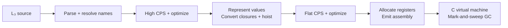

# L₃ Compiler & Virtual Machine

<p align="center">
  <strong>Developed by Eliot Abramo on top of EPFL's L₃ teaching infrastructure</strong>
</p>

<p align="center">
  <strong>Version:</strong> 2026
</p>

<p align="center">
  
  
  
  
  
  
</p>

<p align="center">
  <a href="#quick-start">Quick start</a> ·
  <a href="#inside-the-compiler">Architecture</a> ·
  <a href="#try-something-bigger">Examples</a> ·
  <a href="#testing">Tests</a>
</p>

An optimizing compiler and garbage-collected runtime for a small functional language. L₃ takes Lisp-like source code through a series of explicit intermediate representations and emits assembly for a custom 32-bit register machine. Its C runtime executes the result and reclaims heap memory with a mark-and-sweep garbage collector. The repository includes the compiler, VM, standard library, and programs ranging from Hello, world to Sudoku and Unicode maze generation.

The core implementation work covers CPS translation, value representation and closure conversion, function hoisting, optimization, and garbage collection. [Project origins and attribution](#project-origins).

## Engineering highlights

| Area | Implementation |
| --- | --- |
| **Explicit control flow** | Translation from the core language to continuation-passing style (CPS), with separate handling of tail calls, value-producing expressions, and conditions. |
| **First-class functions** | Closure conversion with captured environments and worker/wrapper functions; known calls can target workers directly. |
| **Optimizing passes** | Constant folding, algebraic simplification, dead-code elimination, common-subexpression elimination, and bounded function/continuation inlining at high and low CPS levels. |
| **Runtime representation** | Tagged integers, characters, booleans, and unit values; heap blocks for compound values and closures. |
| **Automatic memory management** | Bitmap-based marking, an explicit mark stack, 32 segregated free lists, block splitting, and coalescing during sweep. |
| **Validation across stages** | The same language tests run through six interpreter/compiler backends, alongside standalone assembly fixtures for the C VM. |

## Quick start

Use a Unix-like environment with **JDK 21**, **sbt**, **Clang**, and **Make**. **Python 3** is needed for the VM tests. The build pins Scala and sbt versions; the first compiler build downloads dependencies. The CI configuration targets Ubuntu 24.04.

From the repository root:

```sh
git clone https://github.com/Eliot-Abramo/compiler.git
cd compiler
make demo
```

This builds both components, compiles [hello.l3](examples/hello.l3), and runs the generated `out.l3a` file:

```text
Hello, world!
```

To build once and then compile programs directly:

```sh
make
compiler/target/universal/stage/bin/l3c examples/hello.l3
vm/c/bin/vm out.l3a
```

The compiler writes assembly without executing the source program. Input and output happen when the VM runs.

## Inside the compiler



CPS makes the next step of a computation explicit. That gives the optimizer a common representation for function calls, branches, and returns before lowering them to machine instructions.

Start with [Main.scala](compiler/src/l3/Main.scala) to follow the complete pipeline, then explore the main implementation passes:

- [CL3ToCPSTranslator.scala](compiler/src/l3/CL3ToCPSTranslator.scala) — source expressions to continuations.
- [CPSValueRepresenter.scala](compiler/src/l3/CPSValueRepresenter.scala) — tagged values, captured environments, and worker/wrapper conversion.
- [CPSHoister.scala](compiler/src/l3/CPSHoister.scala) — lift nested functions to a flat program.
- [CPSOptimizer.scala](compiler/src/l3/CPSOptimizer.scala) — shrinking rewrites and bounded inlining.
- [memory.c](vm/c/src/memory.c) — allocation, reachability, reclamation, and free-list rebuilding.

The [architecture guide](docs/architecture.md) explains the representations, optimization decisions, and heap layout. The [language guide](docs/language.md) introduces L₃ syntax and modules.

## Try something bigger

Compile the N-queens solver, then ask it for an eight-queen solution:

```sh
compiler/target/universal/stage/bin/l3c examples/queens.l3m
printf '8\n0\n' | vm/c/bin/vm out.l3a
```

| Program | What it does |
| --- | --- |
| [N-queens](examples/queens.l3) | Finds and draws a non-attacking arrangement of queens. |
| [Unicode maze](examples/unimaze.l3) | Generates a maze using disjoint sets and renders it with box-drawing characters. |
| [Big integers](examples/bignums.l3) | Computes factorials beyond the range of the language's immediate integers. |
| [Sudoku](examples/sudoku.l3) | Solves and prints a collection of Sudoku problems. |
| [Game of Life](examples/life.l3) | Simulates Conway's cellular automaton in the terminal. |

Use the corresponding `.l3m` file to include a program's library dependencies. See [example commands](examples/README.md) for custom output paths and more details.

## Testing

```sh
make test          # Scala compiler suites + C VM fixtures
make test-debug    # VM fixtures with address/undefined-behavior sanitizers
```

The compiler suite contains **248 checks** spanning primitives, language constructs, and example outputs. It exercises direct interpretation, CPS interpretation, and assembly execution, with and without optimization. The standalone VM suite compares output against **43 checked-in assembly fixtures**, including N-queens, big integers, mazes, and Sudoku.

[GitHub Actions](.github/workflows/ci.yml) is configured to run both suites, the sanitizer build, and source-to-C-VM checks for Hello, world and N-queens. VM fixtures deliberately remain in version control so the C runtime can be tested independently of the Scala toolchain.

For individual commands, see the [compiler guide](compiler/README.md), [VM guide](vm/c/README.md), and [VM test guide](vm/test/README.md).

## Repository map

```text
compiler/          Scala compiler, intermediate representations, and tests
vm/c/              C virtual machine and garbage collector
vm/test/           Assembly fixtures and a Python standard-library test runner
library/           L₃ modules: lists, vectors, strings, integers, and more
examples/          Runnable programs and module manifests
tests/             Source fixtures and reference input/output
docs/             Architecture and language guides
```

## Project origins

This is an educational compiler project based on EPFL's L₃ infrastructure. The supplied foundation includes the parser, name analysis, interpreters, register allocation and assembly infrastructure, VM execution engine, standard library, and test/example programs. Original author annotations, including those crediting **Michel Schinz**, are retained.

Eliot Abramo's implementation work focuses on the compiler passes and memory manager linked above. The project demonstrates compiler construction and runtime engineering; its target is the L₃ VM instruction set.
